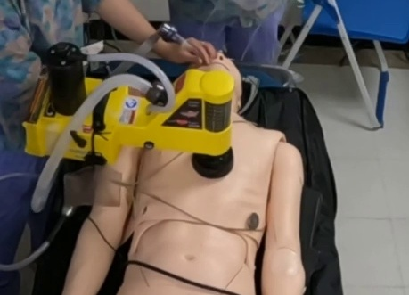
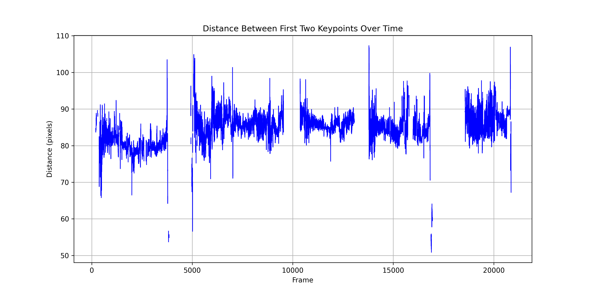

# Machine_Keypoint_Detection
Identify usable features on the machine's body, mark these features as keypoints, and determine whether the machine is operating by analyzing the distance variations between the keypoints.

Examples of images containing the machine:

Results of keypoints detection using YOLO:

Y-axis variation of the distance between points p0 and p1 over time:

